# twifiner 

## Fine-tune your 𝕏 (twitter) experience

**No More Ads or Clutter!** 🚀

Twifiner is a browser extension that enhances your Twitter experience by removing ads, reducing clutter, and providing cool features like easier word muting, account age display, and more.

https://twifiner.ir

**Supported All Chromium-based Browsers:**

 

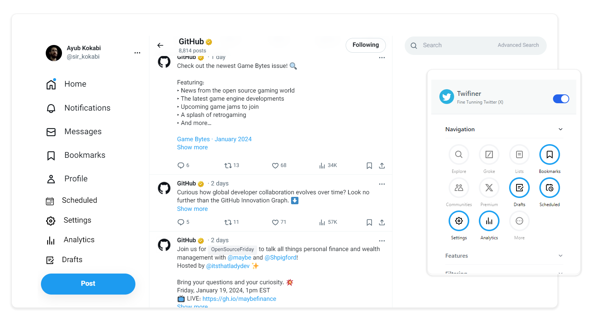

## Features

- **Say Goodbye to Ads:** Twifiner removes ads from your timeline, so you can focus on the content that matters to you. Enjoy a cleaner, ad-free Twitter.

- **No more Distractions:** Twifiner goes beyond removing Ads - it declutters your Twitter by eliminating trends panel, subscribe to premium prompts, who to follow, footer, and other clutter.

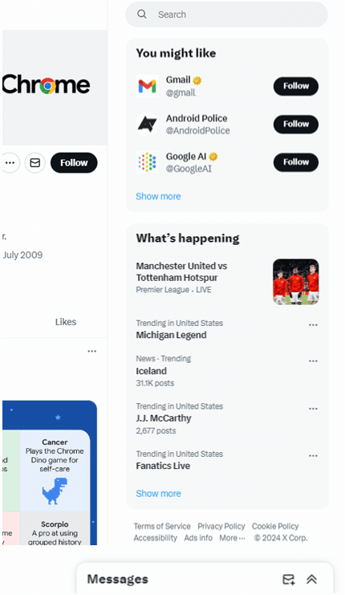

- **Better Tweet Age Display:** Twifiner goes beyond showing tweet age in seconds, minutes, and hours, continuing to display it effortlessly in days, weeks, months, and years. It also removes the extra Id from the tweet for a sleek look.

- **Show Accounts Age:** With Twifiner, you can easily see an account's age at a glance in days, months, or years. No more math needed!

- **Multi-Calendar Date Display:** Twifiner now displays Islamic calendar dates (shamsi and ghamari) next to Gregorian dates in tweets. This adds context and convenience for users in Islamic countries. No more date conversions!

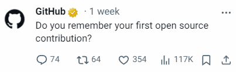

- **Personalize Side Navigation:** Twifiner enables you to remove and replace items from your Twitter side navigation. Choose the features that you value and use more often.

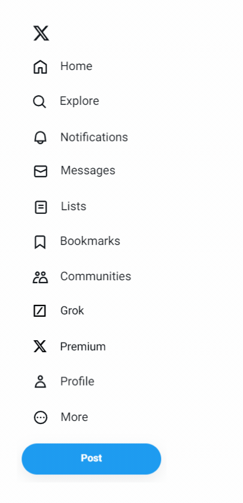

- **Access Essential Tools More Easily:** Twifiner adds useful items like Drafts, Scheduled Tweets, Analytics, and Settings to your side navigation for quick access.

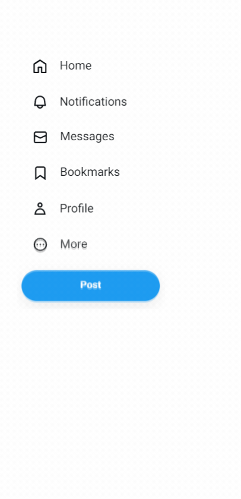

- **Fix RTL Tweets:** Twifiner ensures tweets in right-to-left languages like Persian, Arabic, and Urdu are displayed correctly, fixing the issue of tweets starting with Latin characters being displayed in left-to-right format.

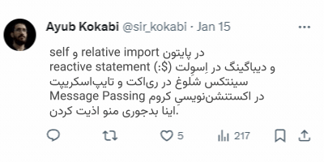

- **Better Persian Tweets:** Twifiner employs the user-friendly 'Vazirmatn' font (designed by the late Saber Rastikerdar) and fixes some common writing errors such as unusual characters, extra spaces, incorrect use of half-spaces, repeated emojis, and more.

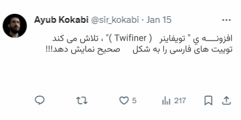

- **Highlight What Matters:** With Twifiner, never miss replying to people who engage with you on Twitter. Reply notifications are highlighted, so they stand out among other notifications. Pinned tweets and mutual followers/following are also highlighted for easy access.

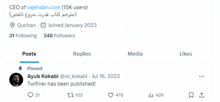

- **Access Advanced Search More Easily:** Twifiner adds a simple advanced search link to the search field, allowing you to access it more quickly than before.

- **Mute words without leaving your timeline:** Twifiner allows you to mute words directly from your timeline, effortlessly filtering out topics or phrases you prefer not to see. Keep your timeline focused on what matters most to you, without relying on Twitter's mute feature.

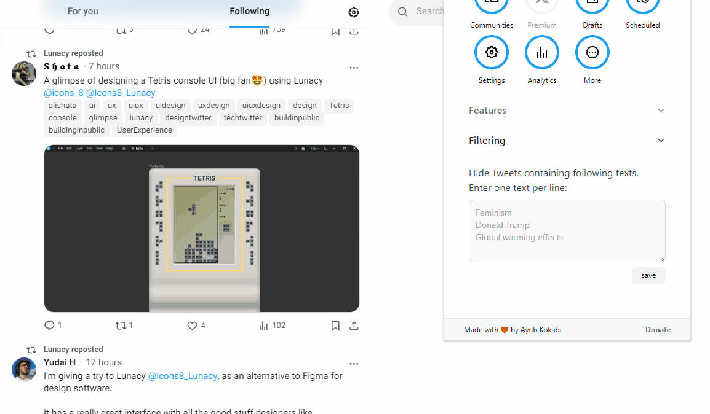

- **No Highlights Tab for Non-Premium Users:** Twitter sometimes shows a ‘Highlights’ tab on your profile, even if you’re not a premium subscriber. Twifiner removes this tab for non-premium users.

- **Move Account Menu to Top:** Twifiner moves the account menu to the top of the page for easier access.

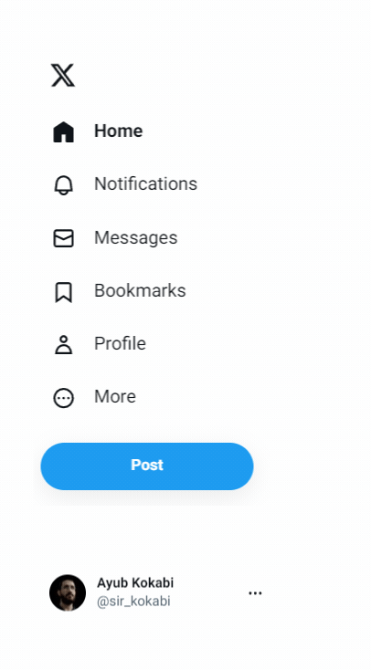

- **Ability to Remove Translate Option:** Twifiner removes the rarely used tweet translation to make tweets cleaner. You can easily restore it whenever needed.

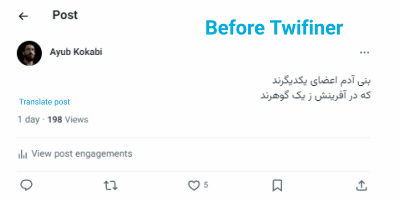

- **Make Hashtags Pop:** Twifiner removes the # symbol from hashtags and adds a subtle background to make them pop, enhancing their visibility and interactivity.

- **Ability to Hide Notification Tab Header:** Twifiner lets you hide the notification tab header, decluttering the notification area for a smoother experience. However, you can restore it if needed.

- **Adjust Your Timeline Width:** Twifiner lets you adjust the width of your timeline, wider or narrower, to fit your preferences.

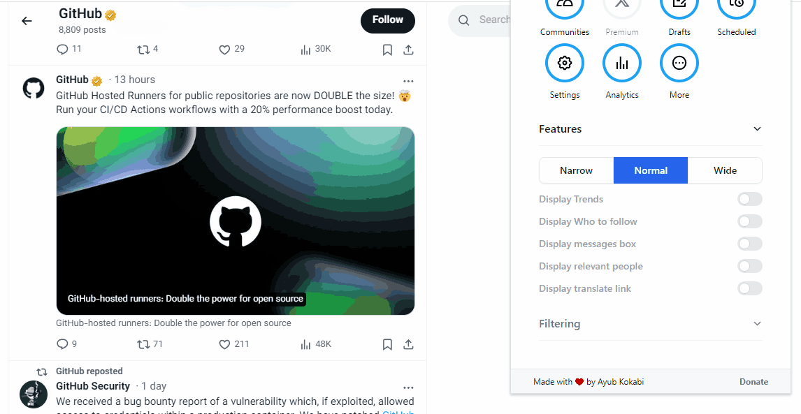

## How to install manually

First download the latest release:

Then follow the instructions below to install Twifiner in your browser:

## Contributing

- Install dependencies: `npm install`
- Start the dev server: `npm run dev` (watches for changes & reloads extension)

- Load the extension in Chrome:
    - Go to `chrome://extensions`
    - Enable `Developer mode`
    - Drag & drop `build/chrome-mv3-dev` directory onto this page

- Create a production build:
    - `npm run build`, 
    - create a production zip bundle: `npm run package`, 
    - The final bundle will be available in the `build/chrome-mv3-prod.zip`

- For more guidance, read [plasmo docs](https://docs.plasmo.com/):

## Support

If you like this project, please consider supporting it with a star ⭐ or a donation. Every donation, no matter how small, is greatly appreciated.
- https://reymit.ir/kokabi
- Bitcoin: **bc1qfcp3xu48dxpvqm2sr9470t0hx3jk9e96tzek7e**
- Lightning: **scarredwall45@walletofsatoshi.com**

